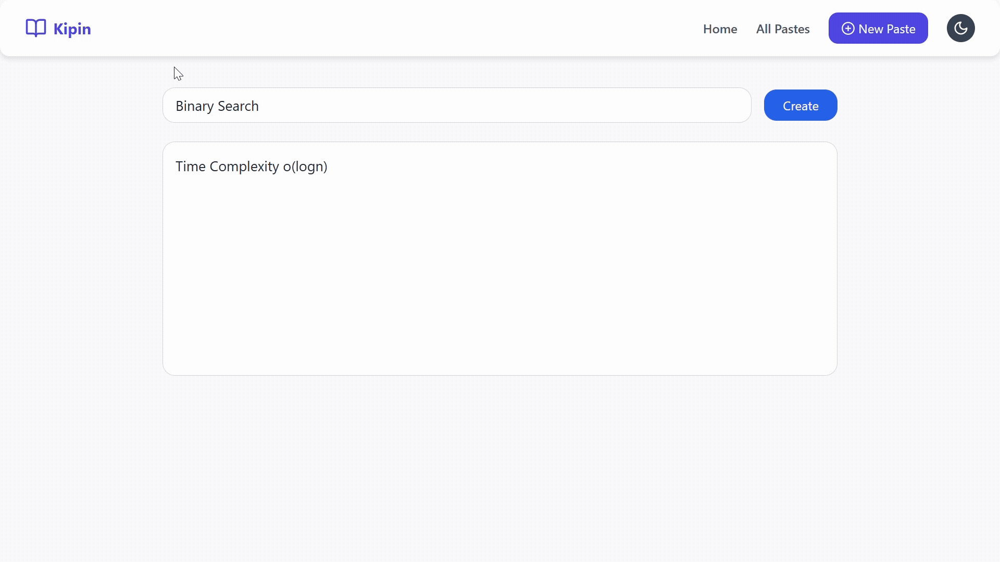

#  Kipin - Notes Saving APP
  



 
 
  
  
  
<br>
  


> Lightweight paste management tool for storing, organizing, and sharing text snippets instantly across devices.
> Built with a clean, responsive UI and persistent storage for quick access to saved content anytime.

🔗 **Live Demo** → [Access Kipin](https://kipin-notes-saving-app-4e5p.vercel.app/)

<br>

---

## 🚀 Features  
- 📝 **Add, remove, and manage notes** with ease  
- 📱 **Offline functionality** using AsyncStorage  
-  **Efficient state management** via Redux  
-  **Minimalist UI** optimized for productivity  
-  **Fast and responsive**, lightweight frontend only
- 🌐 **Deployed on Vercel** for fast and reliable access  

---

## 🛠️ Tech Stack  
- **Framework**: React  
- **State Management**: Redux  
- **Storage**: AsyncStorage (local persistence)  
- **Deployment**: Vercel  

---

## 📂 Project Structure  
```bash
kipin/
│── public/         # Static files (e.g., index.html, favicon)
│── src/
│   ├── assets/
│   ├── components/ # React components (NoteList, NoteForm, etc.)
│   ├── redux/      # Redux store configuration, actions, reducers
│   ├── App.css
│   ├── Index.css
│   ├── main.jsx
│   └── App.jsx    # Main app component
│── index.html
│── vite.config.js
│── tailwind.config.js
│── postcss.config.js
│── package.json
│── package-lock.json
└── README.md
```
<br>

---

## 📸 Screenshots

## Creating Note


## All Notes


---

## 🏁 Getting Started

Follow these steps to set up the project locally:

---

### 1️⃣ Clone the Repository and install dependencies
```bash
git clone https://github.com/ancure-2004/kipin-Notes-Saving-App.git
cd kipin-Notes-Saving-App
npm install
npm run dev
```
---

## 🔮 Future Enhancements
- Future Enhancements
- Dark Mode toggle for a better night-time experience
- Search and filter notes by title or content
- Tagging or categorizing notes for better organization
- Data backup or syncing with cloud (optional for user persistence)

---

## 🤝 Contributing
# We welcome contributions!
- Fork the repository
- Create a new branch (git checkout -b feature-name)
- Make your changes and commit (git commit -m 'Add feature')
- Push to the branch (git push origin feature-name)
- Open a Pull Request

---

## License

This project is licensed under the [MIT License](LICENSE).

### Contact
- 📧 ankur2004tyagi@gmail.com
- 🔗 www.linkedin.com/in/ankur-tyagi2004
